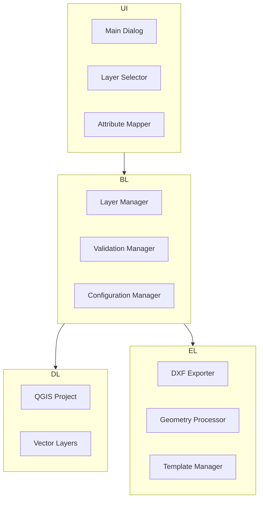

# Design Document

## Overview

The Flexible Sewerage Network DXF Export Plugin is designed as a modular QGIS plugin that provides maximum flexibility for exporting sewerage network data to DXF format. Unlike the original QEsg plugin that requires hardcoded layer names ('PIPES', 'JUNCTIONS') and specific field names (DC_ID, PVM, PVJ, etc.), this plugin allows users to select ANY layers from their QGIS project and map ANY field names to the required sewerage network attributes.

The plugin follows a layered architecture with clear separation of concerns between UI, business logic, and data processing components. The design builds upon the existing RedBasica Export plugin structure while adding comprehensive layer selection, attribute mapping, and validation capabilities. The plugin maintains the same high-quality DXF output as the original QEsg plugin while providing complete flexibility to work with any layer structure, naming convention, or data organization.

## Architecture

### High-Level Architecture



### Plugin Structure

The plugin follows the established QGIS plugin structure with enhancements:

```
redbasica_export/
├── __init__.py                          # Plugin initialization (existing)
├── redbasica_export.py                  # Main plugin class (enhanced)
├── metadata.txt                         # Plugin metadata (updated)
├── ui/
│   ├── __init__.py                      # UI package init
│   ├── main_export_dialog.py           # Main export dialog
│   ├── main_export_dialog.ui           # Main dialog UI design
│   ├── layer_selector_dialog.py        # Layer selection dialog
│   ├── layer_selector_dialog.ui        # Layer selector UI
│   ├── attribute_mapper_dialog.py      # Attribute mapping dialog
│   └── attribute_mapper_dialog.ui      # Attribute mapper UI
├── core/
│   ├── __init__.py                      # Core package init
│   ├── layer_manager.py                # Layer discovery and validation
│   ├── attribute_mapper.py             # Field mapping logic
│   ├── dxf_exporter.py                 # DXF export engine
│   ├── geometry_processor.py           # Geometry utilities
│   ├── template_manager.py             # DXF template handling
│   ├── field_definitions.py            # Required field definitions
│   └── configuration.py                # Settings management
├── resources/
│   ├── icons/                           # Plugin icons
│   ├── templates/                       # DXF templates
│   └── styles/                          # Default styles
├── i18n/                                # Translation files
├── redbasica_export_dockwidget.py      # Enhanced dockwidget
└── redbasica_export_dockwidget_base.ui # Enhanced UI file
```

## Components and Interfaces

### 1. User Interface Components

#### Main Export Dialog (`ui/main_export_dialog.py`)

The primary interface for configuring and executing DXF exports.

**Key Components:**
- **Layer Selection Group**: QgsMapLayerComboBox widgets for pipes and junctions
- **Configuration Buttons**: Access to attribute mapping dialogs
- **Export Options**: Scale, prefix, template selection
- **Advanced Options**: Arrows, labels, elevations toggles
- **Validation Panel**: Real-time validation feedback
- **Preview Panel**: Export summary before execution

**Interface:**
```python
class MainExportDialog(QDialog):
    def __init__(self, layer_manager, template_manager):
        # Initialize UI components
        
    def get_export_configuration(self) -> ExportConfiguration:
        # Return current configuration
        
    def validate_configuration(self) -> List[str]:
        # Validate current settings
        
    def preview_export(self) -> Dict:
        # Generate export preview
```

#### Layer Selector Dialog (`ui/layer_selector_dialog.py`)

Specialized dialog for layer selection with filtering and preview capabilities.

**Features:**
- Geometry type filtering (Line/Point)
- Layer information display
- Field list with types
- Sample data preview
- Layer validation status

#### Attribute Mapper Dialog (`ui/attribute_mapper_dialog.py`)

Comprehensive attribute mapping interface with auto-mapping and validation.

**Features:**
- Required/Optional field tables
- Auto-mapping based on naming patterns
- Default value configuration
- Label format configuration
- Real-time validation feedback

### 2. Core Business Logic

#### Layer Manager (`core/layer_manager.py`)

Handles discovery and validation of ANY layers in the user's QGIS project, regardless of naming conventions.

**Responsibilities:**
- Enumerate ALL project layers and allow user selection (not restricted to specific names)
- Filter layers by geometry type (line for pipes, point for junctions)
- Extract field information from ANY selected layer
- Validate layer compatibility based on geometry type only
- Provide sample data for preview and mapping verification

**Interface:**
```python
class LayerManager:
    def get_available_layers(self, geometry_type: GeometryType = None) -> List[QgsVectorLayer]
    def get_layer_fields(self, layer: QgsVectorLayer) -> Dict[str, FieldType]
    def validate_layer_compatibility(self, layer: QgsVectorLayer, required_geometry: GeometryType) -> List[str]
    def get_sample_data(self, layer: QgsVectorLayer, max_features: int = 5) -> List[Dict]
```

#### Attribute Mapper (`core/attribute_mapper.py`)

Manages flexible field mapping from ANY user field names to required sewerage network attributes with robust data type conversion.

**Responsibilities:**
- Suggest field mappings based on common naming patterns (not enforce specific names)
- Allow completely manual field mapping when auto-mapping fails
- Validate mapping completeness with flexible requirements
- Extract feature data using user-configured mappings with automatic type conversion
- Handle default values for unmapped fields
- Convert string representations of numbers to proper numeric types
- Handle NULL/None values gracefully with appropriate defaults

**Data Type Conversion Strategy:**
```python
class DataConverter:
    @staticmethod
    def to_string(value) -> str:
        """Convert any value to string, handling NULL/None."""
        if value is None or value == NULL:
            return ""
        return str(value).strip()
    
    @staticmethod
    def to_double(value) -> float:
        """Convert string or numeric to float, handling NULL/None and string numbers."""
        if value is None or value == NULL:
            return 0.0
        if isinstance(value, (int, float)):
            return float(value)
        if isinstance(value, str):
            try:
                # Handle string representations like "1.05", "2,50" (Portuguese decimal)
                cleaned = value.strip().replace(',', '.')
                return float(cleaned) if cleaned else 0.0
            except (ValueError, TypeError):
                return 0.0
        return 0.0
    
    @staticmethod
    def to_integer(value) -> int:
        """Convert string or numeric to integer, handling NULL/None."""
        if value is None or value == NULL:
            return 0
        if isinstance(value, int):
            return value
        if isinstance(value, (float, str)):
            try:
                return int(float(str(value).strip().replace(',', '.')))
            except (ValueError, TypeError):
                return 0
        return 0
```

**Auto-mapping Suggestion Patterns (not requirements):**
```python
FIELD_SUGGESTION_PATTERNS = {
    # Common patterns including QEsg as suggestions, not requirements
    "pipe_id": ["DC_ID", "id", "pipe_id", "segment_id", "pipe_name", "codigo", "identificador"],
    "upstream_node": ["PVM", "upstream", "from_node", "start_node", "no_montante", "inicio"],
    "downstream_node": ["PVJ", "downstream", "to_node", "end_node", "no_jusante", "fim"],
    "length": ["LENGTH", "length", "comprimento", "len", "distance", "extensao", "dist"],
    "diameter": ["DIAMETER", "diameter", "diam", "dn", "size", "diametro", "bitola"],
    "upstream_invert": ["CCM", "up_invert", "invert_up", "start_elev", "cota_montante", "cota_inicial"],
    "downstream_invert": ["CCJ", "down_invert", "invert_down", "end_elev", "cota_jusante", "cota_final"],
    "upstream_ground": ["CTM", "up_ground", "ground_up", "cota_terreno_montante", "terreno_inicial"],
    "downstream_ground": ["CTJ", "down_ground", "ground_down", "cota_terreno_jusante", "terreno_final"],
    "slope": ["DECL", "slope", "declividade", "i", "inclinacao", "gradiente"],
    # Junction fields
    "node_id": ["DC_ID", "id", "node_id", "pv_id", "manhole_id", "poco", "poco_id"],
    "ground_elevation": ["ground", "surface", "cota_tn", "elevation", "terreno", "superficie"],
}
```

#### Configuration Manager (`core/configuration.py`)

Handles plugin settings persistence and management.

**Responsibilities:**
- Save/load export configurations
- Manage user preferences
- Handle template paths
- Store field mappings

### 3. Export Engine

#### DXF Exporter (`core/dxf_exporter.py`)

Core DXF export functionality with comprehensive styling and organization.

**Key Features:**
- Template-based or default DXF creation
- Organized layer structure with prefixes
- 3D geometry support with elevations
- Extended entity data for software compatibility
- Comprehensive error handling

**DXF Layer Organization (QEsg Compatible):**
```python
LAYER_DEFINITIONS = [
    ('REDE', 172, 'Sewage pipes/network'),           # Main pipe network
    ('NUMERO', 3, 'Pipe ID labels'),                 # Pipe identification numbers
    ('TEXTO', 3, 'Pipe data labels'),                # Length-diameter-slope labels
    ('TEXTOPVS', 7, 'Manhole elevation data'),       # Manhole elevation blocks
    ('PV', 3, 'Manholes/junctions'),                 # Manhole symbols (circles)
    ('NUMPV', 3, 'Manhole ID labels'),               # Manhole identification
    ('SETA', 172, 'Flow direction arrows'),          # Flow direction indicators
    ('NO', 3, 'Dry point symbols'),                  # Perpendicular lines for dry points
    ('AUX', 241, 'Auxiliary elements'),              # Helper geometry
    ('LIDER', 2, 'Leader lines'),                    # Connection lines
    ('ESG_TQ', 256, 'Drop tube symbols'),            # Special TQ (Tubo de Queda) symbols
]
```

#### Geometry Processor (`core/geometry_processor.py`)

Utility class for geometric calculations and transformations.

**Capabilities:**
- Azimuth and bearing calculations
- Point-along-line calculations
- Perpendicular point generation
- Text rotation alignment
- Arrow placement calculations

#### Template Manager (`core/template_manager.py`)

Manages DXF templates and standard blocks.

**Features:**
- Template discovery and validation
- Default template creation
- Block library management
- Style definitions

## Data Models

### Core Data Structures

```python
from dataclasses import dataclass
from typing import Dict, List, Optional
from enum import Enum

class GeometryType(Enum):
    LINE = "LineString"
    POINT = "Point"
    POLYGON = "Polygon"

class FieldType(Enum):
    STRING = "String"
    INTEGER = "Integer"
    DOUBLE = "Double"
    BOOLEAN = "Boolean"

@dataclass
class RequiredField:
    name: str                           # Internal field name
    display_name: str                   # User-friendly name
    field_type: FieldType              # Expected data type
    description: str                    # Field purpose
    default_value: Optional[str] = None # Default if not mapped
    validation_rules: Optional[Dict] = None

@dataclass
class LayerMapping:
    layer_id: str                      # QGIS layer ID
    layer_name: str                    # Display name
    geometry_type: GeometryType        # Required geometry
    field_mappings: Dict[str, str]     # required_field -> layer_field
    default_values: Dict[str, str]     # required_field -> default_value
    is_valid: bool = False             # Validation status
    validation_errors: List[str] = None

@dataclass
class ExportConfiguration:
    pipes_mapping: LayerMapping
    junctions_mapping: LayerMapping
    output_path: str
    scale_factor: int = 2000
    layer_prefix: str = "ESG_"
    template_path: Optional[str] = None
    include_arrows: bool = True
    include_labels: bool = True
    include_elevations: bool = True
    label_format: str = "{length:.0f}-{diameter:.0f}-{slope:.5f}"
```

### Field Definitions

The plugin defines standard sewerage network fields with localization support:

```python
class SewageNetworkFields:
    PIPES_REQUIRED = [
        RequiredField("pipe_id", "Pipe Identifier", FieldType.STRING, 
                     "Unique identifier for each pipe segment"),
        RequiredField("upstream_node", "Upstream Node", FieldType.STRING,
                     "Identifier of upstream manhole"),
        RequiredField("downstream_node", "Downstream Node", FieldType.STRING,
                     "Identifier of downstream manhole"),
        RequiredField("length", "Length", FieldType.DOUBLE,
                     "Pipe length in meters"),
        RequiredField("diameter", "Diameter", FieldType.DOUBLE,
                     "Pipe diameter in millimeters"),
        RequiredField("upstream_invert", "Upstream Invert", FieldType.DOUBLE,
                     "Upstream invert elevation"),
        RequiredField("downstream_invert", "Downstream Invert", FieldType.DOUBLE,
                     "Downstream invert elevation"),
    ]
    
    PIPES_OPTIONAL = [
        RequiredField("upstream_ground", "Upstream Ground", FieldType.DOUBLE,
                     "Upstream ground elevation"),
        RequiredField("downstream_ground", "Downstream Ground", FieldType.DOUBLE,
                     "Downstream ground elevation"),
        RequiredField("slope", "Slope", FieldType.DOUBLE,
                     "Pipe slope in m/m"),
        RequiredField("material", "Material", FieldType.STRING,
                     "Pipe material"),
        RequiredField("notes", "Notes", FieldType.STRING,
                     "Additional notes or observations"),
    ]
    
    JUNCTIONS_REQUIRED = [
        RequiredField("node_id", "Node Identifier", FieldType.STRING,
                     "Unique identifier for each junction"),
    ]
    
    JUNCTIONS_OPTIONAL = [
        RequiredField("ground_elevation", "Ground Elevation", FieldType.DOUBLE,
                     "Ground surface elevation"),
        RequiredField("invert_elevation", "Invert Elevation", FieldType.DOUBLE,
                     "Junction invert elevation"),
    ]
    
    # Calculated fields (computed from other fields when available)
    CALCULATED_FIELDS = [
        RequiredField("upstream_depth", "Upstream Depth", FieldType.DOUBLE,
                     "Calculated as ground_elevation - upstream_invert"),
        RequiredField("downstream_depth", "Downstream Depth", FieldType.DOUBLE,
                     "Calculated as ground_elevation - downstream_invert"),
        RequiredField("calculated_slope", "Calculated Slope", FieldType.DOUBLE,
                     "Calculated as (upstream_invert - downstream_invert) / length"),
    ]
```

## Error Handling

### Validation Strategy

The plugin implements comprehensive validation at multiple levels:

1. **Layer Validation**: Geometry type, field existence, data type compatibility
2. **Mapping Validation**: Required field coverage, default value completeness
3. **Export Validation**: File permissions, template accessibility, data integrity
4. **Runtime Validation**: Feature geometry validity, calculation errors

### Error Categories

```python
class ValidationError(Exception):
    """Base validation error"""
    pass

class LayerValidationError(ValidationError):
    """Layer-specific validation issues"""
    pass

class MappingValidationError(ValidationError):
    """Field mapping issues"""
    pass

class ExportError(Exception):
    """Export process errors"""
    pass
```

### Error Recovery

- **Graceful Degradation**: Skip invalid features, continue processing
- **User Feedback**: Clear error messages with suggested solutions
- **Fallback Options**: Default templates when custom templates fail
- **Progress Reporting**: Detailed progress with error counts

## Testing Strategy

### Unit Testing

- **Layer Manager**: Layer discovery, field extraction, validation logic
- **Attribute Mapper**: Auto-mapping algorithms, validation rules
- **Geometry Processor**: Geometric calculations, coordinate transformations
- **DXF Exporter**: DXF structure creation, entity generation

### Integration Testing

- **UI Workflows**: Complete export workflows with various layer types
- **Configuration Persistence**: Settings save/load functionality
- **Template System**: Template loading and block usage
- **Error Scenarios**: Invalid data handling, permission issues

### User Acceptance Testing

- **Layer Compatibility**: Various layer structures and naming conventions
- **Export Quality**: DXF output validation in CAD software
- **Performance**: Large dataset handling
- **Usability**: Interface intuitiveness and workflow efficiency

## Performance Considerations

### Optimization Strategies

1. **Lazy Loading**: Load layer data only when needed
2. **Batch Processing**: Process features in batches for large datasets
3. **Memory Management**: Efficient geometry processing and cleanup
4. **Caching**: Cache layer metadata and field information

### Scalability

- **Feature Count**: Handle projects with thousands of features
- **Layer Count**: Support projects with many layers
- **Field Count**: Manage layers with extensive attribute tables
- **File Size**: Generate efficient DXF files

## External Dependencies

### Required Libraries

The plugin requires the following external libraries for DXF processing:

#### ezdxf Library
- **Purpose**: DXF file creation, manipulation, and export
- **Version**: >= 1.0.0 (latest stable)
- **License**: MIT License (compatible with GPL)
- **Installation**: Available via pip (`pip install ezdxf`)

**Key ezdxf Features Used:**
```python
import ezdxf
from ezdxf import zoom
from ezdxf.enums import TextEntityAlignment
from ezdxf.addons import text2path
```

**ezdxf Capabilities:**
- Modern DXF format support (R2018, R2021)
- 3D geometry and elevation handling
- Block definitions and insertions
- Extended entity data (XDATA)
- Layer management and styling
- Text entities with alignment
- Complex geometry types

### Dependency Management Strategy

#### Bundled Libraries (Implemented)
The plugin includes bundled libraries in the `addon/` directory:
```
redbasica_export/
├── addon/
│   ├── ezdxf/                    # Bundled ezdxf library for DXF operations
│   └── c3d/                      # Bundled c3d library (potential 3D geometry support)
```

**Import Strategy:**
```python
import sys
import os

# Add addon directory to Python path
addon_path = os.path.join(os.path.dirname(__file__), 'addon')
if addon_path not in sys.path:
    sys.path.insert(0, addon_path)

# Import bundled libraries
try:
    import ezdxf
    from ezdxf import zoom
    from ezdxf.enums import TextEntityAlignment
except ImportError as e:
    raise ImportError(f"Failed to import bundled ezdxf library: {e}")

# Optional c3d import (if needed for advanced 3D operations)
try:
    import c3d
    C3D_AVAILABLE = True
except ImportError:
    C3D_AVAILABLE = False
```

#### Library Roles

**ezdxf Library:**
- Primary DXF file creation and manipulation
- Entity generation (lines, circles, text, blocks)
- Layer management and styling
- 3D coordinate handling
- Extended entity data (XDATA) support

**c3d Library (Optional):**
- Advanced 3D curve and surface operations
- Potential use for complex pipe routing calculations
- 3D geometric transformations
- Currently bundled for future enhancements

### Library Integration

#### DXF Document Creation
```python
# Template-based creation
if template_path and os.path.exists(template_path):
    doc = ezdxf.readfile(template_path)
else:
    doc = ezdxf.new('R2018')  # Modern DXF version

# Set up application ID for extended data
doc.appids.new('REDBASICA_EXPORT')
```

#### Layer Management
```python
# Create organized layer structure
layer_definitions = [
    ('ESG_PIPES', 172, 'Sewage pipes/network'),
    ('ESG_PIPE_LABELS', 3, 'Pipe segment labels'),
    ('ESG_PIPE_ARROWS', 172, 'Flow direction arrows'),
    ('ESG_JUNCTIONS', 3, 'Manholes/junctions'),
    ('ESG_JUNCTION_LABELS', 3, 'Junction labels'),
]

for name, color, description in layer_definitions:
    doc.layers.new(name, dxfattribs={'color': color})
```

#### Entity Creation
```python
msp = doc.modelspace()

# Add 3D line with elevation data
line = msp.add_line(
    start=(x1, y1, z1), 
    end=(x2, y2, z2),
    dxfattribs={'layer': 'ESG_PIPES', 'color': 256}
)

# Add extended data for software compatibility
line.set_xdata('REDBASICA_EXPORT', [
    (1000, 'PIPE_DATA'),
    (1040, pipe_diameter),
    (1040, pipe_length),
    (1000, pipe_material)
])
```

### Installation Requirements

#### No External Installation Required
Since the libraries are bundled with the plugin, users don't need to install any external dependencies. The plugin is self-contained and ready to use after installation.

#### Dependency Checking
The plugin will verify bundled libraries are accessible:
```python
def check_dependencies():
    """Check if bundled dependencies are available."""
    try:
        # Add addon path
        addon_path = os.path.join(os.path.dirname(__file__), 'addon')
        if addon_path not in sys.path:
            sys.path.insert(0, addon_path)
        
        import ezdxf
        version = getattr(ezdxf, '__version__', 'unknown')
        
        # Check for c3d availability
        c3d_status = "available" if C3D_AVAILABLE else "not available"
        
        return True, f"ezdxf {version} available, c3d {c3d_status}"
    except ImportError as e:
        return False, f"Bundled libraries not accessible: {e}"
```

## Security Considerations

### File Access

- **Path Validation**: Validate output paths and prevent directory traversal
- **Permission Checking**: Verify write permissions before export
- **Template Security**: Validate template files before loading

### Data Privacy

- **No External Communication**: Plugin operates entirely offline
- **Local Processing**: All data processing occurs locally
- **User Control**: Users control all data and export destinations

### Library Security

- **Trusted Sources**: Use ezdxf from official PyPI repository
- **Version Pinning**: Specify minimum version requirements
- **Vulnerability Monitoring**: Keep dependencies updated

## Internationalization

### Translation Support

- **UI Strings**: All user-facing text translatable
- **Field Names**: Localized display names for standard fields
- **Error Messages**: Translated error messages and help text
- **Documentation**: Multilingual user documentation

### Locale Handling

- **Number Formats**: Respect locale-specific number formatting
- **Date Formats**: Handle date fields according to locale
- **Coordinate Systems**: Support various coordinate system conventions